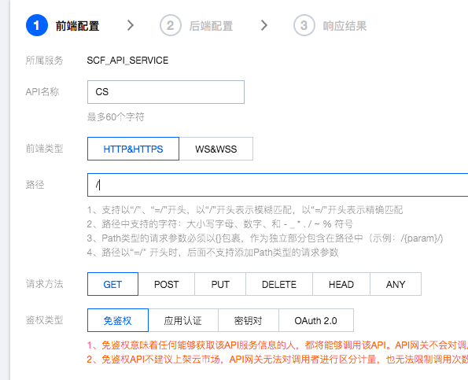
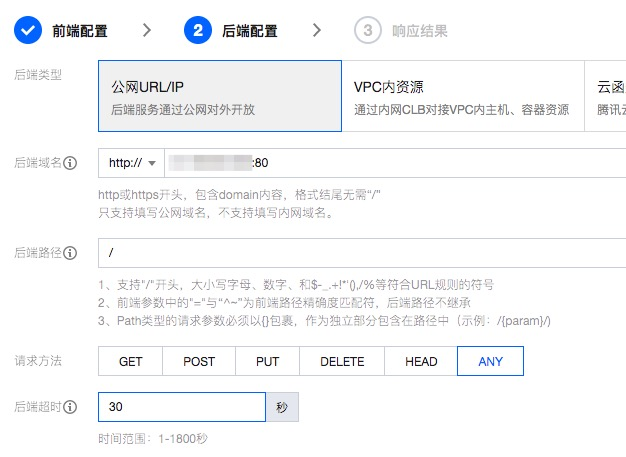
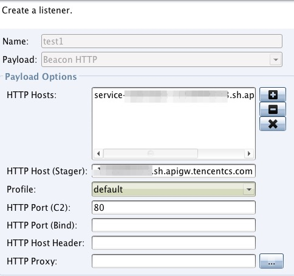

# C2 域名隐藏

该功能无需任何代码，只需要在 [API 网关](https://console.cloud.tencent.com/apigateway/service) 注册服务即可

## 网关配置
1. 在[API 网关](https://console.cloud.tencent.com/apigateway/service)中新建服务，访问方式选择公网，其余不变
2. 进入服务见面，新建 API 配置如下，进入下一步

3. 配置后端类型为**公网URL/IP**，后端域名配置自己的 CS 服务器，后端超时拉满即可。

## CS 配置
将网关地址填入 host 监听器即可

