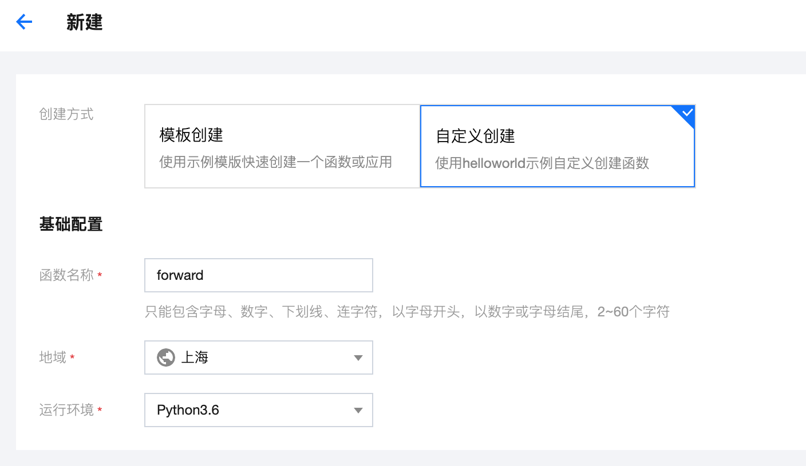
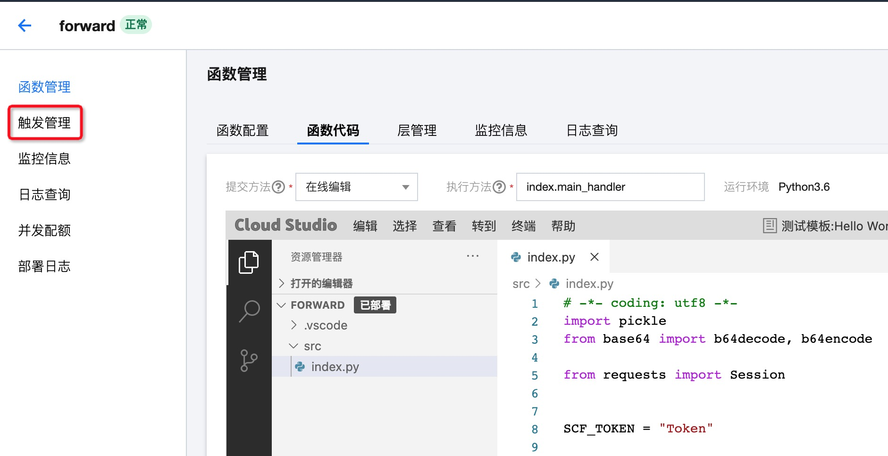
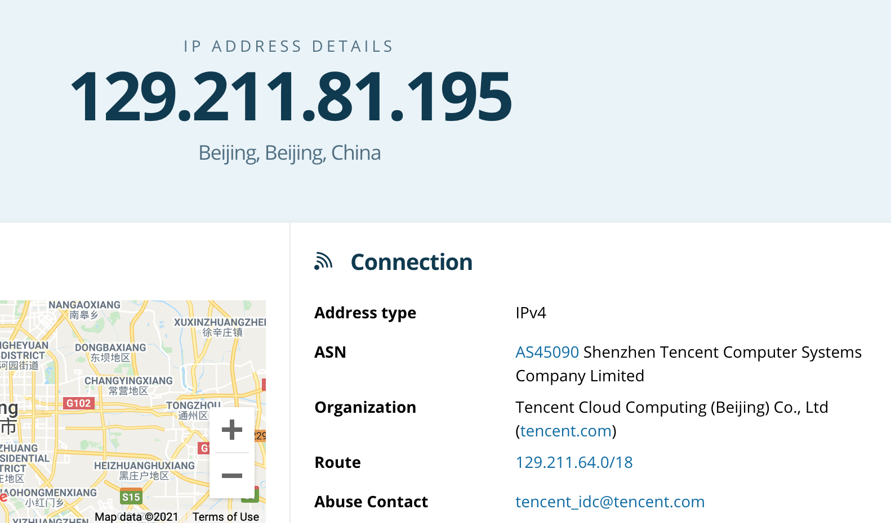

# HTTP Proxy
## 安装
需 Python >= 3.8
```bash
python3 -m venv .venv
source .venv/bin/activate
pip3 install -r requirements.txt
```

## 项目配置
### 函数配置
1. 开通[腾讯云函数服务](https://console.cloud.tencent.com/scf/list)
2. 在 函数服务 > 新建 中使用自定义创建，函数名称及地域任选，运行环境选择 Python3.6。


3. 修改 server.py 中的 `SCF_TOKEN` 为随机值（该值将用于鉴权），并将相同的值填入 client.py 中的 `SCF_TOKEN`，将 server.py 代码复制粘贴到编辑器中。
4. 点击完成

### 触发器配置
1. 成功创建函数后进入 触发管理，创建触发器



2. 触发方式选择 API 网关触发，其他保持不变即可


3. 将触发器中的访问路径粘贴至 client.py 中 `scf_server` 变量。


## 客户端配置
本项目基于 mitmproxy 提供本地代理，为代理 HTTPS 流量需安装证书。
运行 `mitmdump` 命令，证书目录自动生成在在 ~/.mitmproxy 中，安装并信任。

开启代理开始运行：
```bash
mitmdump -s client.py -p 8081 --no-http2
```

## 效果
挂上代理获取当前 ip 为 129.211.81.195:

查询 ipinfo 为腾讯的服务器:


### ip 数量
经测试 200 个请求共分配了 71 个 ip。

## 限制
1. 请求与响应流量包不能大于 6M
2. 云函数操作最大超时限制默认为 3 秒，可在云函数环境配置中修改执行超时时间
3. 因云函数限制不能进行长连接，仅支持代理 HTTP 流量

## 免责声明
此工具仅供测试和教育使用，请勿用于非法目的。
